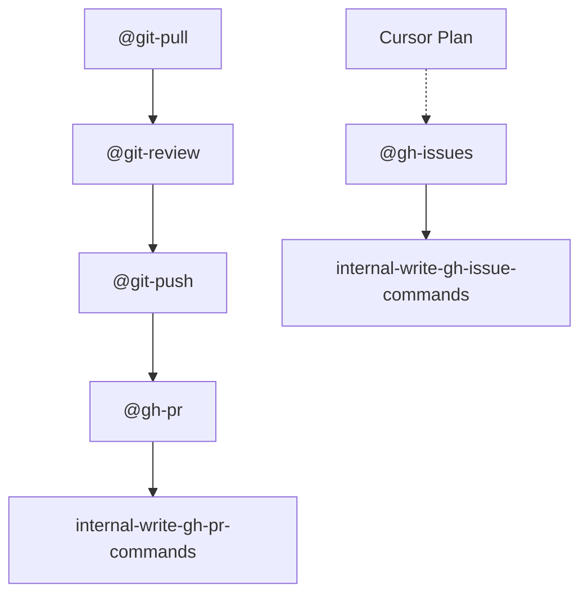

# Legacy graphs scaffold (compact)

Use this only for repositories that still keep a legacy graphs page. Keep the content short and rely on in-pack skill links.

## Rules

- Keep diagrams acyclic and focused on core public skills.
- Do not copy full command lists into this file.
- Source operational behavior from `skills/**/SKILL.md`.

## Minimal graph

## See also

- [`internal-read-git-doc-graphs`](../SKILL.md)
- [`internal-read-git-repo-layout`](../../repo-layout/SKILL.md)
- [`internal-read-git-workflows`](../../workflows/SKILL.md)
