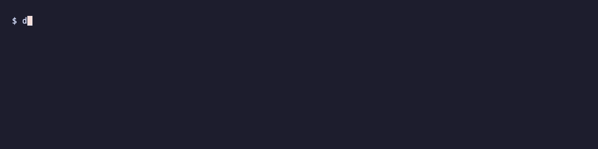
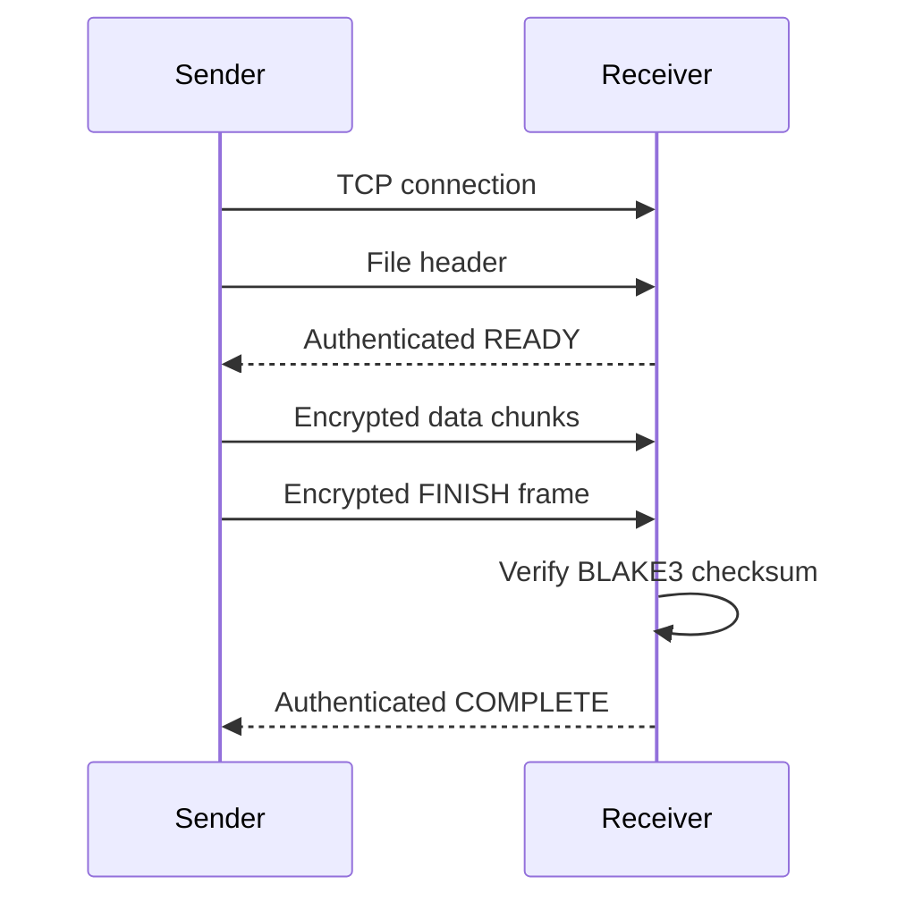

# deltasafe

deltasafe sends files between computers on the same local network and checks that each file arrived unchanged.

> [!NOTE]
> **Status:** Experimental CLI prototype (v0.1.2); Linux/macOS tested, not production-audited. Every automated test and recorded validation run transfers over loopback (`127.0.0.1`) on a single machine; transfers between separate computers have not been tested.

- Encrypts files while sending them and checks their contents before saving.
- Uses a shared password or key so sender and receiver can verify they know the same secret.
- Saves received files only after checking them, and does not overwrite existing files.
- Can scan local network ports to look for receivers.

## Quick start

You need Git and Rust 1.85+ with Cargo ([rustup](https://rustup.rs/); version in [Cargo.toml](Cargo.toml)). The first build downloads dependencies. The example below transfers a small file between two terminals on the same machine; no second computer or network discovery is needed.

Build once from the cloned repository:

~~~bash
git clone https://github.com/rustfuture/deltasafe.git
cd deltasafe

cargo build --locked
~~~

Start the receiver on a local port with a password (8 to 128 bytes; the length is counted in UTF-8 bytes, so a non-ASCII character counts as more than one):

~~~bash
cargo run --locked -- server --address 127.0.0.1:12345 --password "MySecret123"
~~~

Keep that receiver running. In another terminal, `cd` to the same cloned `deltasafe` directory, create a directory and send it to the receiver:

~~~bash
mkdir -p ./my_folder && echo "hello" > ./my_folder/hello.txt
cargo run --locked -- sync \
  --source ./my_folder \
  --target 127.0.0.1:12345 \
  --password "MySecret123"
~~~

The receiver saves files under `received_files/`; compare `received_files/hello.txt` with `my_folder/hello.txt` to check this example. Stop the receiver with Ctrl+C. If the port is already in use, choose another port in both commands. Use a new source filename when repeating: existing destination files are not overwritten. For direct key mode and other options, see [the project details](docs/project-details.md).

## How it works

- The sender walks the source directory and connects to the receiver over TCP.
- For each file, it sends a header with the relative path, file size, and BLAKE3 checksum, a summary used to check file contents.
- Sender and receiver derive a temporary key from the shared password or key. The sender encrypts the file in numbered chunks, and the receiver checks each chunk.
- The receiver writes to a temporary file, checks the final size and checksum, then publishes it if the destination does not already exist.

See [the protocol outline and architecture notes](docs/project-details.md#protocol-outline) and [docs/architecture.md](docs/architecture.md) for more detail.

## Scope and limitations

`deltasafe` is designed for trusted local networks and controlled filesystems. It does not provide device identity or protection against every filesystem race. Read the [full limitations and security notes](docs/project-details.md#scope-and-limitations) before use.

## Tests

The CI workflow runs:

~~~bash
cargo fmt --check
cargo check --locked --all-targets
cargo clippy --locked --all-targets -- -D warnings
cargo test --locked -- --test-threads=1
~~~

The tests cover command parsing, cryptography and hashes, loopback file transfers, transfer failures (including a checksum mismatch on otherwise valid frames), and path safety.

## License

MIT. See [LICENSE](LICENSE).
